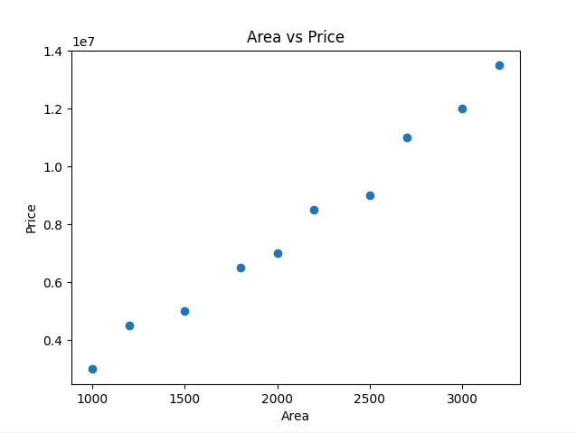
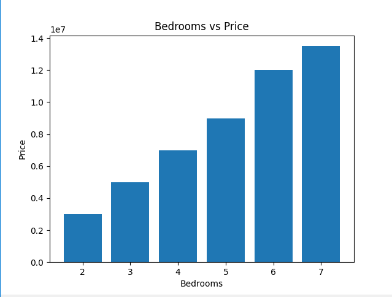

# Housing Price Data Analysis

## 📌 Description
This project analyzes housing price data using Python to understand how area, bedrooms, and bathrooms affect house prices.

## 🛠️ Tools Used
- Python
- Pandas
- Matplotlib

## 📊 Output
### Area vs Price

### Bedrooms vs Price

## 📁 Files
- housing_data.csv
- analysis.py
- graph1.png
- graph2.png

## 👩‍💻 Author
P Vidisha
## 🚀 Live House Price Predictor

You can try the live app here:

👉 [Click Here to Use the App](https://housing-price-analysis-cj5dplci7schlk7ycgqk4a.streamlit.app/)

## 🔮 Sample Input
Area = 2000  
Bedrooms = 3  
Bathrooms = 2  

## 💰 Output
Estimated Price = 6017974
